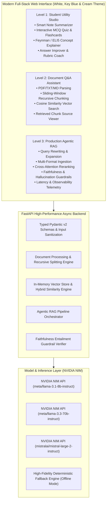
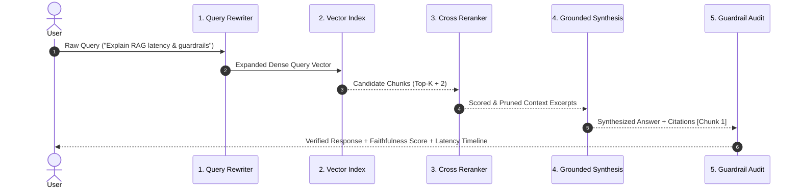

# 🧠 CortexAI Studio — Multi-Tier AI Engineering Platform

[](https://fastapi.tiangolo.com)
[](https://docs.pydantic.dev/)
[](https://build.nvidia.com/)
[](https://www.docker.com/)
[](LICENSE)

**CortexAI Studio** is a modular, production-grade AI platform implementing a progressive multi-tier architecture across **Beginner**, **Intermediate**, and **Advanced** enterprise AI engineering workflows. Built with a bespoke **White, Key Blue, and Warm Cream** user interface, a high-performance **FastAPI** backend with typed **Pydantic v2** validation, and native integration for **NVIDIA NIM** inference microservices.

---

## 🏛️ System Architecture



---

## 📊 Multi-Tier Capabilities Breakdown

### 1. 🐣 Level 1: AI-Powered Student Utility App (Beginner)
Designed to evaluate core AI development fundamentals, prompt engineering, structured schemas, input sanitization, and output handling.

* **Smart Note Summarizer**:
  - 4 distinct pedagogical modes: *Structured Bullet Points*, *Executive Synthesis*, *Exam-Cram Cheat Sheet*, and *Key Definitions & Terms*.
  - Strict input validation enforcing content length minimums and sanitization.
* **Interactive MCQ Quiz & Flashcards Generator**:
  - Enforces typed JSON schemas to produce multiple-choice assessments.
  - Interactive UI with real-time green/red scoring, instant explanations, and flashcard mnemonics.
* **Concept Explainer**:
  - Pedagogical multi-depth breakdown (*The Feynman Technique*, *ELI5*, *High School*, *Academic Rigorous*).
  - Automatically synthesizes real-world analogies and self-check questions.
* **Answer Improver & Diagnostic Rubric**:
  - Evaluates student drafts on Clarity, Technical Depth, and Factual Accuracy with revised model answers.

---

### 2. 🚀 Level 2: Document-Based Q&A Assistant (Intermediate)
Designed to evaluate document ingestion, chunking algorithms, embedding generation, vector similarity retrieval, and grounded text synthesis.

* **Document Ingestion**: Drag-and-drop & file picker parser supporting **PDF, TXT, and Markdown**.
* **Recursive Hierarchical Chunking**:
  - Hierarchical text splitting across paragraphs and sentences with a 60-character sliding overlap.
  - Prevents loss of boundary concepts across chunk margins while maintaining uniform token budgets.
* **Vector Similarity Engine**:
  - Computes high-dimensional Cosine Similarity:
    $$\text{Cosine Similarity} = \frac{\mathbf{u} \cdot \mathbf{v}}{\|\mathbf{u}\| \|\mathbf{v}\|}$$
  - Enhanced with lexical sub-phrase and keyword presence heuristics.
* **Grounded Synthesis & Zero Ungrounded Guessing**:
  - Constrains LLM outputs strictly to retrieved context excerpts.
  - Interactive chunk inspector displaying matched text segments, character offsets, and similarity percentages.

---

### 3. ⚡ Level 3: Production-Style Agentic RAG Assistant (Advanced)
A production-grade Retrieval-Augmented Generation system with end-to-end observability, reranking, and hallucination guardrails.



* **5-Stage Agentic Workflow**:
  1. **Query Decomposition & Rewriting**: Transforms vague user prompts into high-density technical query vectors.
  2. **Document-Scoped Vector Retrieval**: Fetches candidate chunks across ingested documents.
  3. **Cross-Attention Reranking**: Re-scores candidate excerpts using Jaccard cross-attention heuristics to filter noise.
  4. **Grounded Synthesis with Inline Citations**: Formulates structured responses with citations (`[Chunk 1]`, `[Doc: name]`).
  5. **Faithfulness & Entailment Guardrail**: Computes mathematical token entailment ratios between source text and generated statements to calculate an objective faithfulness score (0–100%).
* **Observability Telemetry**:
  - Live execution timeline tracking micro-stage latency in milliseconds ($ms$).
  - Quantitative chunk relevance score matrix.

---

## 🎨 Design System

Built on an intentional, non-generic design language:
- **Canvas**: Warm Cream (`#FAF7F2` / `#F4EFE6`)
- **Cards & Modals**: Pure Crisp White (`#FFFFFF`) with subtle ambient drop shadows
- **Primary / Key Accent**: Royal Key Blue (`#2563EB`) & Cobalt (`#1D4ED8`)
- **Typography**: Clean `Inter` for interface elements and `JetBrains Mono` for telemetry and code.

---

## 🚀 Quickstart & Installation

### Prerequisites
- Python 3.10+
- Optional: Docker & Docker Compose
- Optional: NVIDIA NIM API Key (`nvapi-...`)

### Option 1: One-Command Python Launcher (Recommended)
```bash
# 1. Clone the repository
git clone https://github.com/vishnuHas/CortexAI-Studio-.git
cd CortexAI-Studio-

# 2. Run the launcher
python run_suite.py
```
*The launcher will automatically install dependencies, start the FastAPI server, and open `http://localhost:8000`.*

### Option 2: Docker Compose (Containerized Production Deployment)
```bash
# 1. Copy environment template
cp .env.example .env

# 2. Build and start container
docker-compose up --build

# 3. Access at http://localhost:8000
```

### Option 3: Manual Backend Setup
```bash
cd backend

# Create virtual environment
python -m venv venv

# Activate virtual environment
# Windows:
.\venv\Scripts\activate
# Linux/macOS:
source venv/bin/activate

# Install dependencies
pip install -r requirements.txt

# Start FastAPI server
uvicorn app.main:app --host 0.0.0.0 --port 8000 --reload
```

---

## 🔑 NVIDIA NIM API Configuration

CortexAI Studio is built for [NVIDIA NIM](https://build.nvidia.com/) microservices:

1. **Via Environment Variable**:
   Create a `.env` file in the root directory (do not commit this file):
   ```env
   NVIDIA_API_KEY=nvapi-your-key-here
   NVIDIA_BASE_URL=https://integrate.api.nvidia.com/v1
   DEFAULT_CHAT_MODEL=meta/llama-3.1-8b-instruct
   ```

2. **Via Interactive UI**:
   Paste your API key directly into the configuration drawer in the web interface.

> **Offline Mock Engine**: If no API key is provided, the platform automatically switches to an intelligent offline mock engine, enabling complete functional testing with zero setup friction.

---

## 📚 API Endpoints Reference

| Method | Endpoint | Description |
| :--- | :--- | :--- |
| `GET` | `/api/health` | System status, active model & API key verification |
| `POST` | `/api/config/api-key` | Dynamically update active NVIDIA API key & model |
| `POST` | `/api/level1/summarize` | Note summarization with 4 pedagogical styles |
| `POST` | `/api/level1/generate-quiz` | Generates typed JSON assessment MCQs & flashcards |
| `POST` | `/api/level1/explain-concept` | Feynman / ELI5 conceptual breakdown |
| `POST` | `/api/level1/improve-answer` | Rubric scoring & answer polish |
| `POST` | `/api/level2/upload` | Ingests PDF/TXT and generates recursive chunks |
| `POST` | `/api/level2/query` | Grounded Q&A against uploaded document |
| `POST` | `/api/level3/upload-multi` | Multi-format document batch ingestion |
| `POST` | `/api/level3/query-rag` | Full 5-stage agentic production RAG pipeline |

---

## 🧪 Automated Testing

Run the automated test suite to verify all pipeline tiers:
```bash
python backend/test_suite.py
```

---

## 📁 Repository Structure

```
CortexAI-Studio/
├── backend/
│   ├── app/
│   │   ├── config.py                 # Configuration & environment loader
│   │   ├── main.py                   # FastAPI application & static mount
│   │   ├── models/schemas.py         # Pydantic v2 request/response schemas
│   │   ├── services/
│   │   │   ├── nvidia_client.py      # NVIDIA NIM client & fallback engine
│   │   │   ├── student_utility.py    # Level 1 service logic
│   │   │   ├── doc_processor.py      # PDF/TXT extraction & recursive chunker
│   │   │   ├── vector_store.py       # In-memory cosine similarity engine
│   │   │   └── rag_pipeline.py       # Level 3 agentic RAG orchestrator
│   │   └── routers/
│   │       ├── level1_routes.py      # Level 1 API routes
│   │       ├── level2_routes.py      # Level 2 API routes
│   │       └── level3_routes.py      # Level 3 API routes
│   ├── test_suite.py                 # Automated unit tests
│   ├── requirements.txt              # Backend dependencies
│   └── Dockerfile                    # Container configuration
├── frontend/
│   ├── index.html                    # White, Key Blue & Cream UI
│   ├── css/style.css                 # Responsive stylesheet
│   └── js/
│       ├── app.js                    # State management & routing
│       ├── level1.js                 # Student utility & quiz logic
│       ├── level2.js                 # Document Q&A & chunk viewer
│       └── level3.js                 # Production RAG & observability timeline
├── docker-compose.yml                # Docker Compose orchestration
├── .env.example                      # Safe environment template
├── .gitignore                        # Git exclusion rules
├── run_suite.py                      # 1-command startup launcher
└── README.md                         # Technical documentation
```

---

## 📄 License

This project is licensed under the MIT License — see the [LICENSE](LICENSE) file for details.
